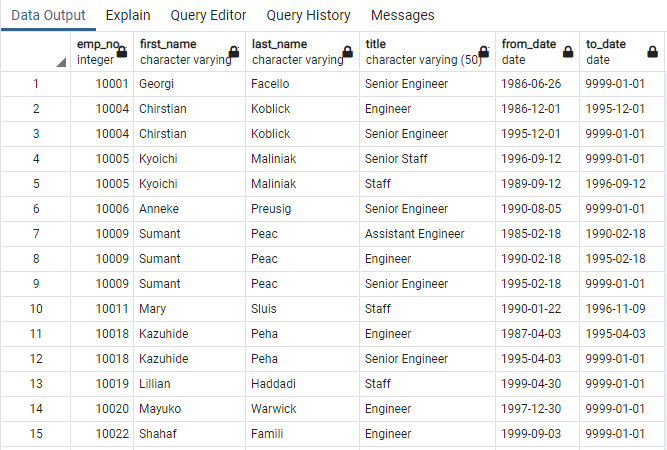

# **Overview**
The purpose of this analysis is to determine the number of retiring employees and identify employees that are eligible to participate in a mentorship program. This will help Pewlett-Hackard prepare for the open positions that will be available as employees retire and to mentor new employees as they replace those that have retired. 

# **Results**

## Retiring Employees 

* The first step in obtaining the number of employees retiring, is to pull the number of employees born between 1952 and 19522. This information is pulled by joining the employees and titles tables and creating a new table, ret_titles. 

* The next step is to remove duplicate entries of employees that have held several positions in Hewlett Packard. This is done by using the distinct on function to retrieve the first occurence of the employee number from the ret_titles table that was created in the first step. Employees that have left the company is filtered out on the to_date column and only dates that are equal to 01/01/1999 are kept. A new table is created called, unique_titles. 

 
	
* Finally, the number of employees that will be retiring by title is obtained by retrieving the number of titles from the unique_titles table. Then the titles are grouped and sorted in descending order. A new table to hold this information is created and called retiring_titles. 

 

## Mentorship Program

* The managers for the Sales and Development departments want to begin a mentorship program in which employees getting ready to retire will mentor new hires on a part time basis. They want to now which employees are eligibility to participate in the mentorship program. This is done by joining the employees table, dept_emp table and the titles table. They are joined by the primary key, common column, emp_no. This information is placed in a new table called mentorship_eligibility.

 

# **Summary**

 Looking at the retiring_titles table, the total number of positions that will be left vacant is 72,458. Senior Engineers has the most positions that will be vacant with a total amount of 25,916 which accounts for 36% of the total retiring titles. Management has the least with only 2. With this information Pewlett Hackard can prioritize which positions will require more effort in replacing the employees as they retire.  

 The amount of employees retiring exceeds the amount of those eligibile for the mentorship program. The mentorship_eligibility table shows there are 1,549 emloyees that are eligible which is only 2% of the total employees that will be retiring. Which means there are not enough employees to mentor new hires. 

	
# **Further Analysis**

To get a further breakdown of how many employees are eligible for the mentorship program a query of the number of employees can be done by department and getting a count of the titles and then grouping them by title and place them in descending order. A table is then created to hold this information. This allows for the manager of each department to see how many employees are eligible for the mentorship program. 

To get an understanding of where Hewlett Packard compares with current market pay rate, they need to look at salaries by title. The table created below, titles_salary, provides a look at what each employee is compensated based on title. This will allow Hewlett Packard to see where and if any modifications need to be made in salaries and be a competive employer. 

 

 
	
 